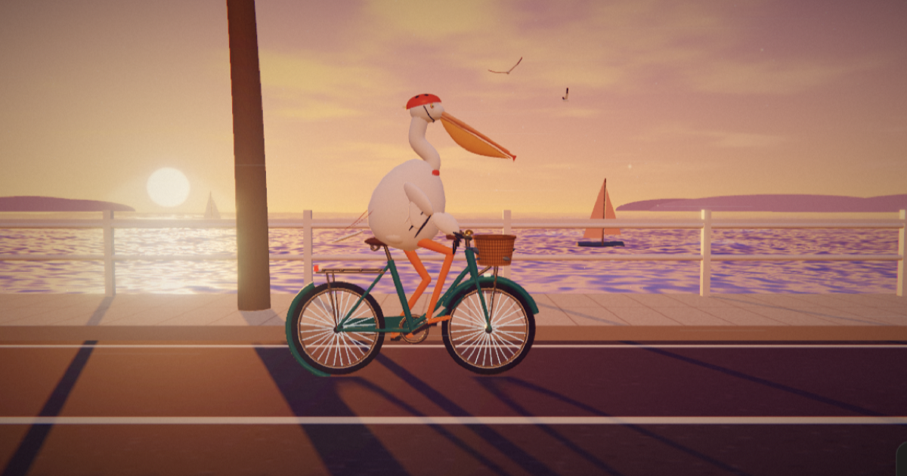

# 鹈鹕骑车 · Pelican on a Bike

日落时分的海岸一号公路，一只戴着红头盔的鹈鹕骑上单车出门接鱼。

**在线体验：https://yuhan9988.github.io/pelican-ride/**

English: https://yuhan9988.github.io/pelican-ride/?lang=en

## 玩法

| 按键 | 动作 |
| --- | --- |
| W / S | 加速 / 刹车 |
| A / D | 变道 |
| 空格 | 跳跃 |
| T | 特技（空中 360° 转体，地面翘头） |
| F | 接鱼 |
| B | 打铃 |
| C 或 1–5 | 切换镜头：自由环绕、追随、侧面跟拍、电影运镜、鹈鹕视角 |
| U | 隐藏界面 |
| M | 背景音乐 |
| K | 拍照（带水印） |
| G | 60 秒接鱼挑战：开到空中的鱼下面用嘴接，金鱼要跳起来接；结束后生成成绩卡，可一键发到 X |
| R | 录制 15 秒带水印的视频（含游戏声音） |

骑行时会有海鸥俯冲下来抢车筐里的鱼，按 B 打铃可以把它吓跑。

手机上有触屏按钮。共 18 个成就等你解锁。页面支持中英文切换。

## 技术

- 单个 HTML 文件，Three.js r128
- 自写着色器：晚霞云层天空、带太阳反光和岸边浪花的海面
- 后期：泛光 + 电影调色 + 暗角 + 胶片颗粒
- 鹈鹕的双腿用两段式 IK 实时踩踏板
- 背景音乐和音效全部用 Web Audio 实时合成，没有音频文件

## 灵感

灵感来自 Simon Willison（[@simonw](https://x.com/simonw)）的经典 AI 测试「画一只骑自行车的鹈鹕」。

## 作者

Yuhan 钰涵 · X [@yuhan119988](https://x.com/yuhan119988)
